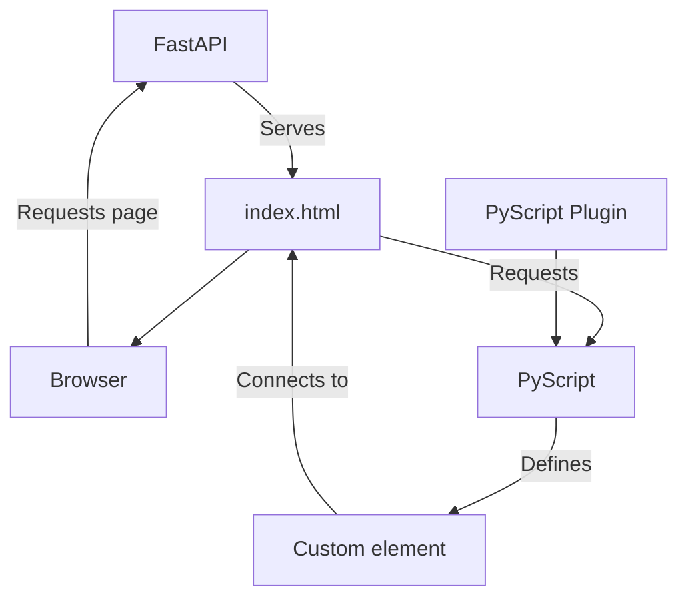

# PyScript demo

This is a tiny project to show using PyScript to create functional web components without much JavaScript. This came from an exploration of creating some kind of "end-to-end Python" web application for a [PhillyPUG talk on 2023-04-27](https://speakerdeck.com/daneah/end-to-end-python).

## Getting started

```shell
$ git clone git@github.com/daneah/pyscript-demo.git
$ cd pyscript-demo
$ # create a virtual environment how you like
$ python -m pip install -r requirements.txt
$ python -m uvicorn server.main:app
```

This will run the application on port `8000` so you can open it in your browser. The page you'll see there describes what's actually going on in the app.

## Architecture


